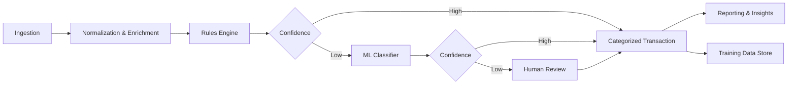

# Smart Expense Categorization System

A production-ready blueprint for an automated system that ingests expense data, enriches it, and categorizes transactions with an ML-assisted workflow. This repository defines the product scope, architecture, data model, APIs, ML lifecycle, and operational requirements needed to build and deploy a real-world system.

## Goals
- Provide consistent, explainable expense categorization across merchants, channels, and regions.
- Enable low-latency categorization for real-time workflows and batch processing for backfills.
- Support continuous learning with human-in-the-loop feedback and robust monitoring.

## Non-Goals
- Building the full UI or integration code in this repository.
- Shipping production credentials or infrastructure secrets.

## High-Level Features
- **Transaction ingestion** from bank feeds, cards, and manual uploads.
- **Normalization & enrichment** (merchant normalization, MCC mapping, geo context).
- **Hybrid categorization** (rules engine + ML classifier + fallback heuristics).
- **Human review workflow** for low-confidence predictions and policy overrides.
- **Auditability** (explanations, model lineage, decision logs).
- **Analytics & reporting** for category spend insights.

## System Overview

## Repository Structure
- `docs/PROJECT_SPEC.md` — detailed requirements, scope, and milestones.
- `docs/ARCHITECTURE.md` — service architecture, data model, API surface.

## Recommended Tech Stack
- **Backend**: Python (FastAPI) or Node.js (NestJS)
- **Data**: Postgres + Redis + object storage (S3/GCS)
- **ML**: Python (scikit-learn, LightGBM), feature store (Feast optional)
- **Streaming/Batch**: Kafka + Airflow (or AWS Step Functions)
- **Observability**: Prometheus + Grafana + OpenTelemetry
- **CI/CD**: GitHub Actions + Docker + IaC (Terraform)

## Next Steps
1. Review `docs/PROJECT_SPEC.md` for scope and milestones.
2. Use `docs/ARCHITECTURE.md` to implement services and APIs.
3. Replace placeholder schemas with your domain-specific categories and taxonomies.

## Step-by-Step Build (Backend)
1. **Set up the environment**
   - Install Python 3.11+ and create a virtual environment.
2. **Install dependencies**
   - `pip install -e .`
3. **Run the API**
   - `uvicorn app.main:app --reload`
4. **Try the endpoints**
   - `GET /health`
   - `POST /v1/transactions`
   - `POST /v1/transactions/{id}/categorize`
   - `GET /v1/transactions`
5. **Run tests**
   - `pytest`

See `docs/RUNBOOK.md` for a detailed setup guide, dependency list, and sample curl commands.

## Contributing
This repository is a blueprint. Add implementation code in `services/` and `packages/` as your build out begins. Ensure all changes include tests and documentation updates.
